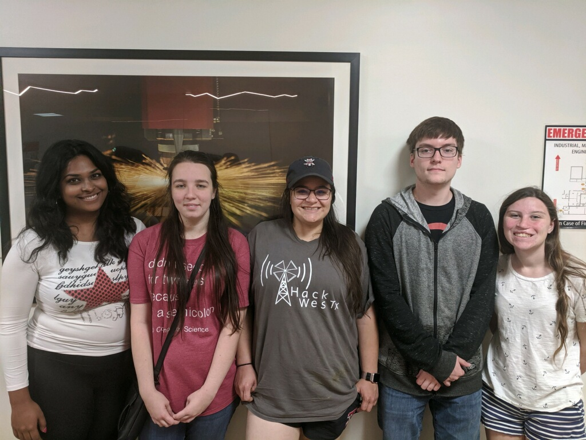

# Interactive Mirror Project
Human Computer Interaction project 1

Team members:

Josephine Willgrubs - Team Leader (Base Interface Design/Health Tracker)

Josephine and Chloe will be implementing the base interface design, which includes the menu the applications are in and the windows the applications the windows will run in on the mirror. They will also be implementing the Health Tracker application, which will include health statistics like the user's current weight and how long the user slept the previous night.

Chloe Osgood - Programmer (Base Interface Design/Health Tracker)

Aishwarya Anand - Programmer (Clock Display and Weather Display)
Aishwarya will be working on the Clock display (a digital clock showing hour, minute and seconds)  and the weather information. These would be implemented using the p5.js library of processing and HTML5.

Charlotte Phillips - Programmer (Music Player)
Charlotte will be designing and implementing the music player. The user can play music they have uploaded into the mirror. The player will be implemention using the p5.js library.

Donald Soundy - Programmer (Display Switch)
Donald will be implementing a switch that will clear the mirror of all applications so the users may attend to themselves unperturbed. 
There will be an additional function that brings back the applications upon pressing the button again.

Donald will be implimenting a switch that will clear the mirror of all applications so the users may attend to themselves unperturbed. 
There will be an additional function that brings back the applications upon pressing the button again.

 

Objective:
The interactive mirror is a website that mimics the operations of a personal mirror with interactive features. These include:

- A digital clock
- Weather display
- Health tracker
- Main menu with access to:
    1. Music Player
    2. Youtube
    3. News Feed
    4. Social Media
    5. Display switch
    
Additional features being considered for development:
- Phone Sync
- Light Source
- Customizable Display

 

Sketches:

Current condition: Default setting of the menu.

Current condition: The user has opened the menu.

Current condition: The user is dragging a menu option into an open slot to activate the app.

Current condition: The application is open and operating for the user.

Current condition: The user is finished with the app and drags it to the menu to close it.

Current condition: The menu is organized by most recently used. The music player is now the most recently used.

Current condition: The user can open a larger menu that holds more apps

As of 10/19/19:
 - Created basic code for webcam display
 - Development of music player underway
 - Development of weather display underway
 - Development of clock display underway
 - Development of applications underway
